# 女゛ぁ！ エンディング一覧（全14種類）

スマホ幅（390px）で表示したエンディング画面のキャプチャです。
テスト用フックで卒業式の直前の状態を作って表示しています（画像内の「エンディング ◯/14」は撮影した順番）。

| | エンディング | 条件 |
|---|---|---|
| 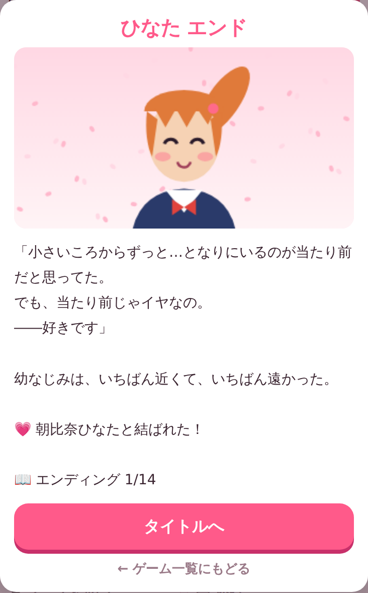 | ひなた | 中学の同級生。同じ高校に来て、好感度80以上・運動65以上 |
| 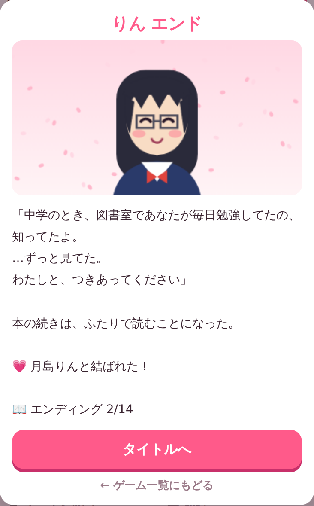 | りん | 中学の同級生。同じ高校に来て、好感度80以上・学力70以上 |
| 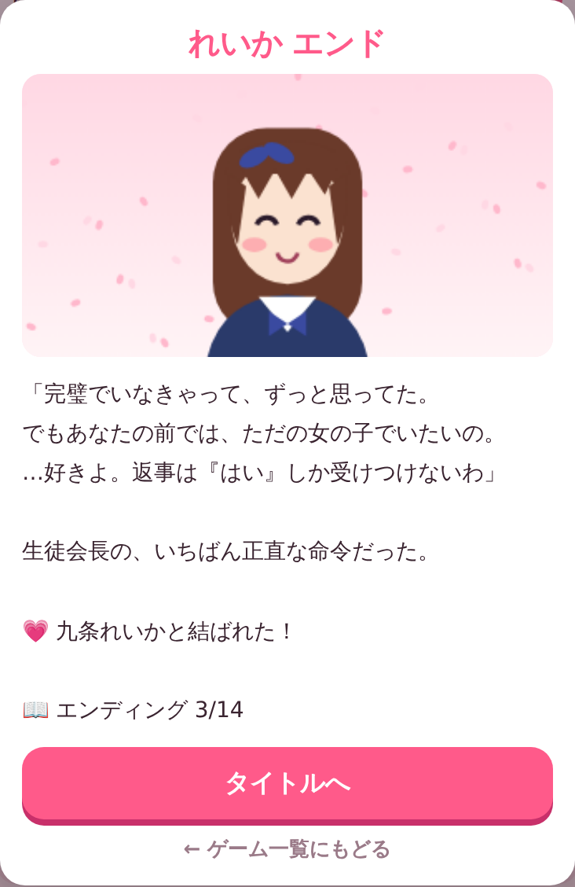 | れいか | 星陵高校。好感度80以上・学力75以上 |
| 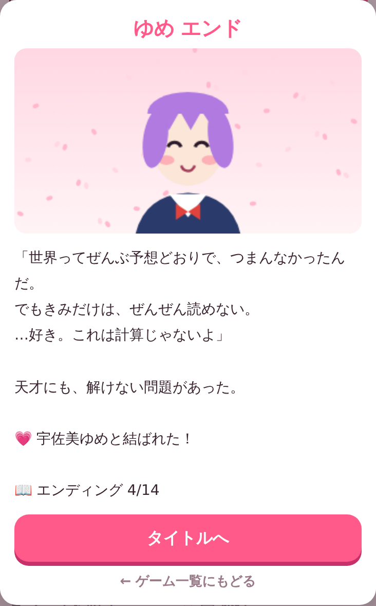 | ゆめ | 星陵高校。好感度80以上・トーク70以上 |
| 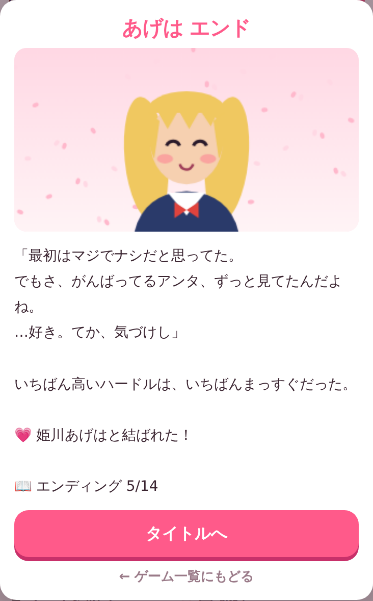 | あげは | 桜川高校。好感度80以上・見た目72以上 |
| 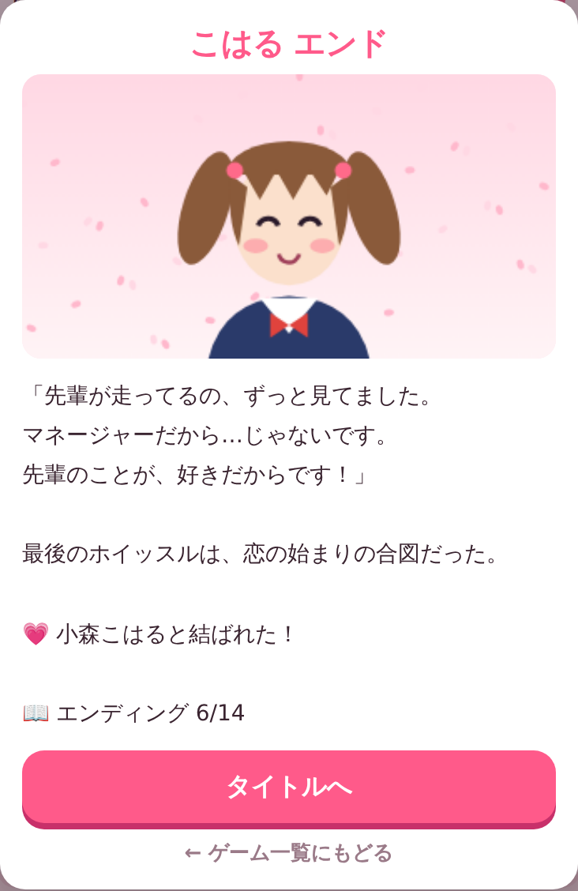 | こはる | 桜川高校（高2から登場）。好感度80以上・運動65以上 |
| 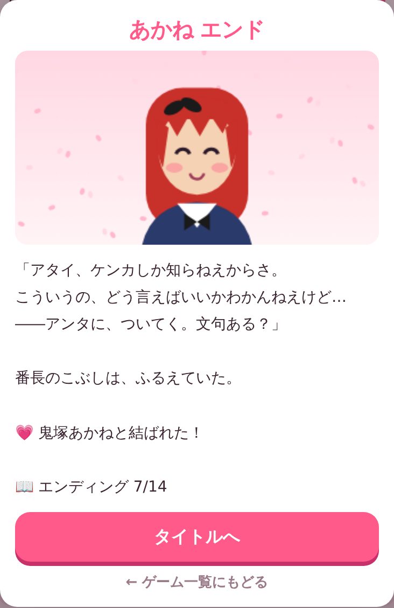 | あかね | 井原髑髏学園。好感度80以上・運動70以上 |
| 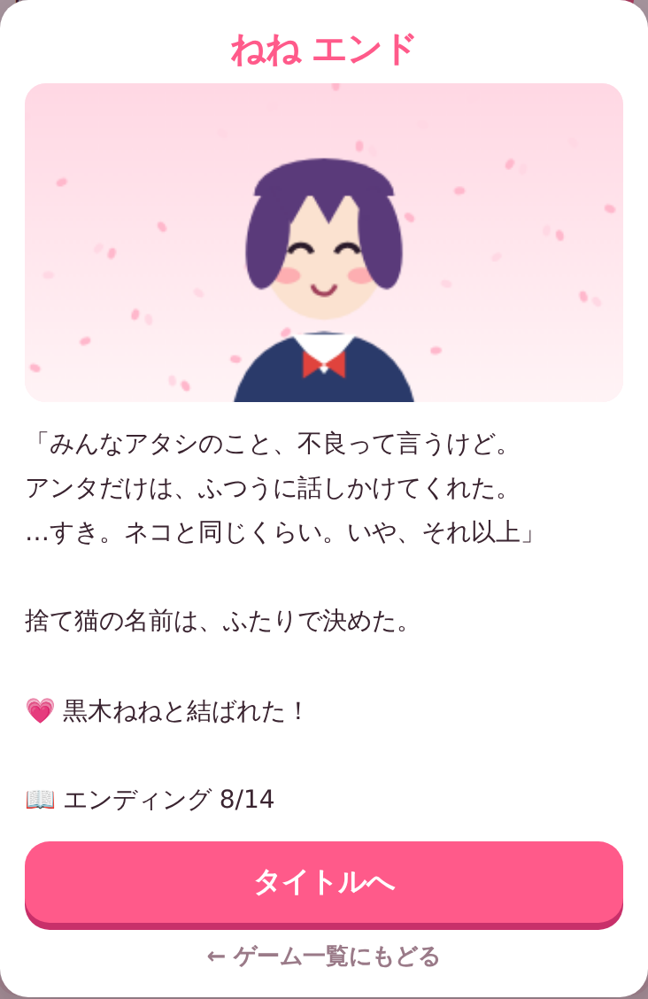 | ねね | 井原髑髏学園。好感度80以上・トーク65以上 |
| 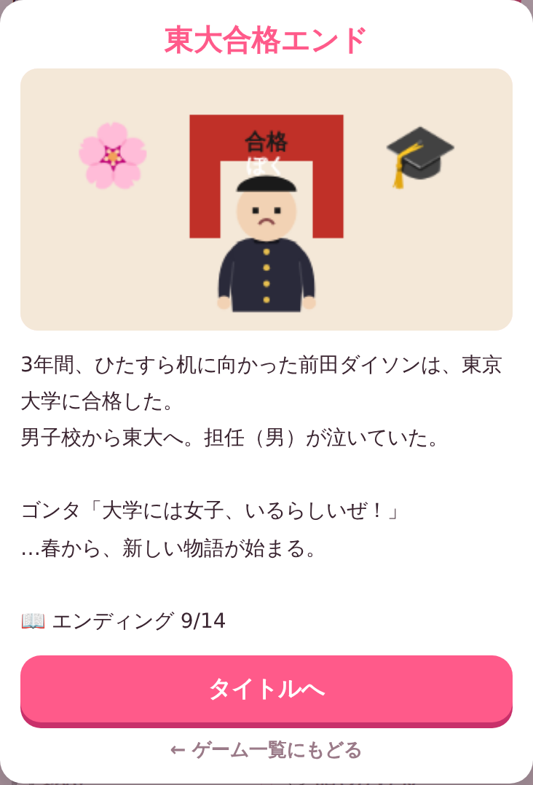 | 東大合格 | 告白されず、卒業時の学力が90前後以上 |
| 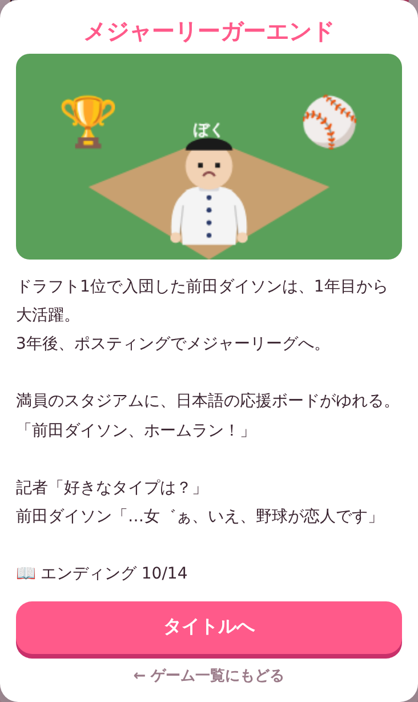 | メジャーリーガー | 告白されず、ドラフト1位 |
| 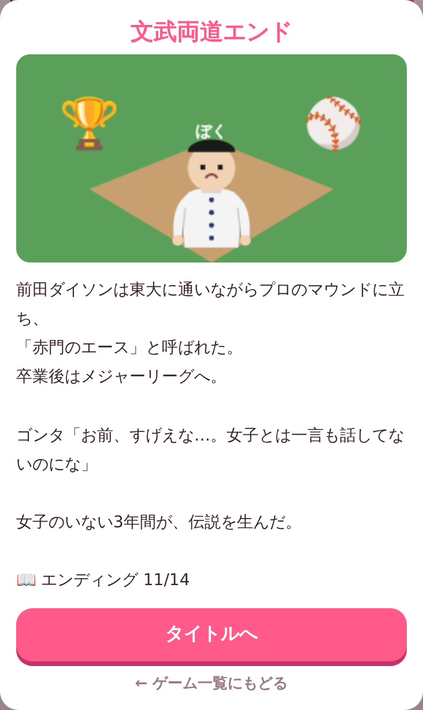 | 文武両道 | 告白されず、東大合格とドラフト1位の両方 |
| 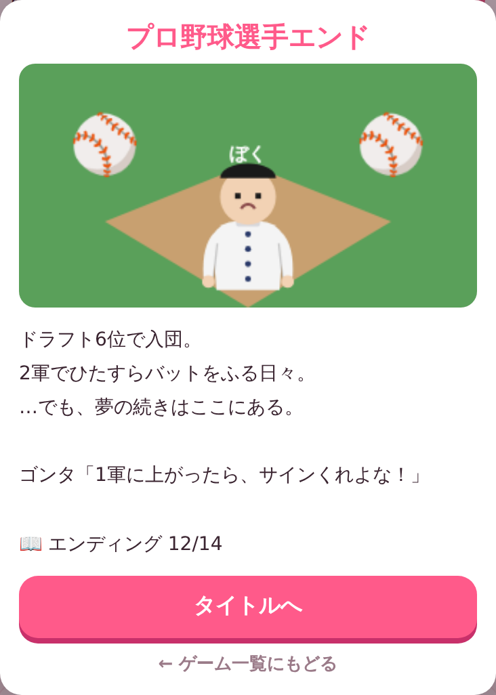 | プロ野球選手 | 告白されず、ドラフト6位 |
| 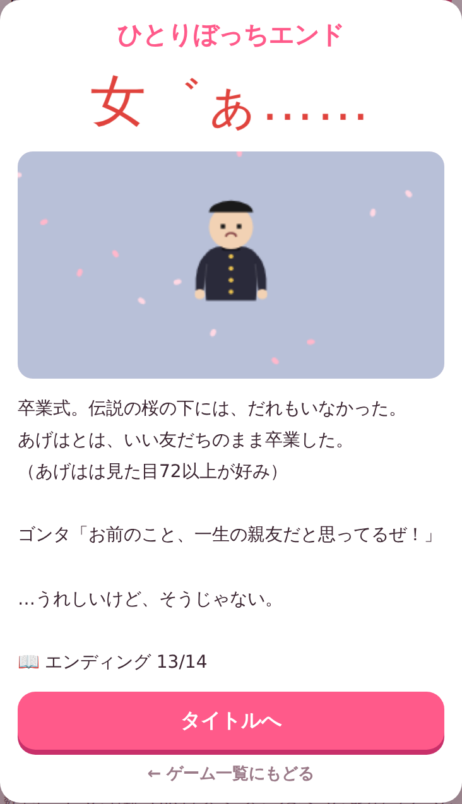 | ひとりぼっち | 共学で、どれにも当てはまらない |
| 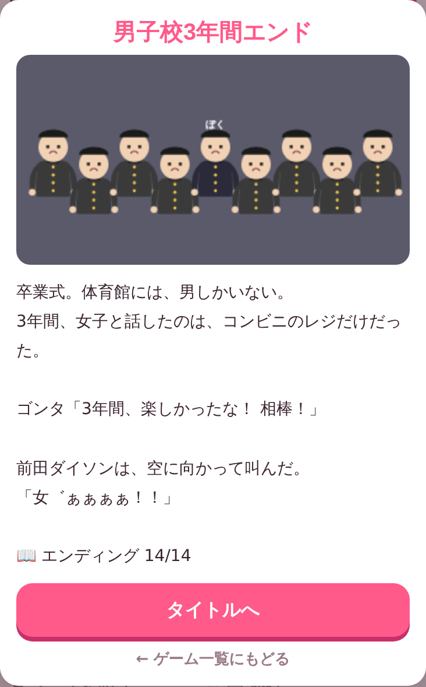 | 男子校3年間 | 男子校で、どれにも当てはまらない |
